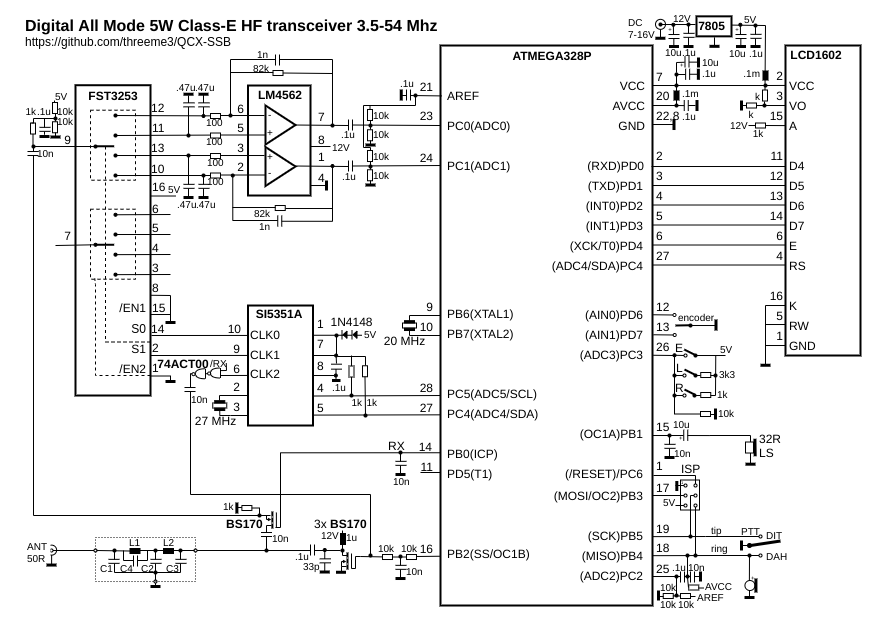

# uSDX Plus Orange: micro Software Defined Transceiver

**uSDX Plus Orange** es un fork refactorizado y mejorado del firmware uSDX, basado en usdxWHITEBUTTONS v4.00d de GW8RDI y el proyecto original uSDX de PE1NNZ. Incluye mejoras significativas en calidad de TX, corrección de errores y funciones de protección, manteniendo compatibilidad total con ATMEGA328P (2KB RAM, 32KB flash).

## Mejoras específicas del fork:

### Mejoras en TX:
- **Coeficiente de filtro de audio GW8RDI** (K=2) — restaura el cuerpo/calidez en las frecuencias bajas del audio SSB transmitido
- **LUT de linealización de PA no lineal** — curva de ley de potencia para mejorar la linealidad SSB
- **Rampa de inicio suave de envolvente TX** — rampa de ~1.7ms elimina los clics de PTT
- **Limitador suave MAX_DP** — compresión 4:1 en lugar de recorte brusco para mejor pureza espectral
- **SWR foldback** — reducción automática de drive cuando SWR>2.5; apagado de TX cuando SWR>4.0
- **Predistorsión AM-PM** — tabla PROGMEM de 16 entradas que compensa el desplazamiento de fase del PA clase-E según la amplitud
- **Desvanecimiento de portadora** — transición suave a ~18% antes de desactivar CLK, eliminando el corte abrupto de portadora

### Corrección de errores:
- Compresor de voz desactivado por defecto (causaba mala calidad de audio SSB)
- Acceso PROGMEM a la rampa de CW key-click corregido (dirección pgm_read_byte_near/off-by-one)
- Etiquetas de case duplicadas en paramAction() eliminadas

### Características adicionales:
- Limitador de recorte suave, compresor de voz, EQ de micrófono, Pre-énfasis (todos configurables vía menú)

---

## Lista de características:
- **Transceptor QRP SSB HF simple, divertido y versátil** con funciones **DSP y SDR** integradas
- **Etapa de transmisión SSB clase-E EER**
- Aproximadamente **5W PEP de salida SSB** desde alimentación de 13.8V
- **Soporte multi-modo: USB, LSB, CW, AM, FM**
- **Filtros DSP: 4000, 2500, 1700, 500, 200, 100, 50 Hz de ancho de banda**
- **Funciones DSP: Control Automático de Ganancia (AGC), Reducción de Ruido (NR), Transmisión por Voz (VOX), Atenuadores de RX (ATT), Filtro de ruido de TX, Control de drive TX, Control de volumen, Medidor dBm/S.**
- Supresión de banda lateral opuesta/portadora **TX: mejor que -45dBc, IMD3 (dos tonos) -33dBc, RX: mejor que -50dBc**
- **Soporte multibanda**, sintonizable continuamente de **160m a 10m** (y de 20kHz..99MHz con pérdida de rendimiento)
- **Código abierto**, construido con Arduino IDE; permite experimentación, nuevas funciones y contribuciones vía Github
- **VOX** software que puede usarse como **Break-In completo rápido** (operación QSK y semi-QSK)
- **Diseño de hardware simple** con solo **4 CI, un microcontrolador y pocos transistores/pasivos**
- **Diseño ligero y de bajo costo**: gracias a la etapa clase-E EER es **altamente eficiente** (sin disipadores voluminosos)
- **Etapa de transmisión SSB completamente digital**: muestrea el micrófono y reconstruye una señal SSB controlando la fase del PLL SI5351 y la amplitud del PA mediante PWM
- **Etapa de recepción SDR completamente digital**: muestrea señal I/Q del detector de muestreo en cuadratura y realiza un desfase de 90 grados matemáticamente (transformada de Hilbert)
- Tres atenuadores de front-end analógico conmutables independientes (0dB, -13dB, -20dB, -33dB, -53dB, -60dB, -73dB)
- **Decodificador CW**, keyer Straight/Iambic-A/B
- **VFO A/B + RIT y Split**, con conmutación de filtros de banda por relé vía I2C
- **Soporte CAT** (subconjunto TS480), posibilidad de transmitir audio, teclas y texto de pantalla por CAT
- **Medición de SWR/Potencia** y control de eficiencia/sobrecarga del PA
- **Indicador de voltaje de batería**
- Probablemente el transceptor SDR/SSB autónomo más **económico** y **fácil** de construir

## Historial de revisiones:
| Rev. | Fecha | Características |
|------|-------|-----------------|
| [v5.17+] | 2024 | Rama `dev` — Corrección de errores TX, coeficiente de filtro K=2, LUT de PA no lineal, rampa de envolvente TX, limitador suave MAX_DP, SWR foldback, predistorsión AM-PM, desvanecimiento de portadora |
| [v5.16] | 2024 | Línea base TX legacy, corrección de menú |
| [v5.15] | 2024 | Eliminación de DEBUG ifdef, corrección de navegación de menú |

## Esquema:

## Hardware:
Existen muchas construcciones de uSDX posibles. Algunas implementaciones comunes:
- [uSDX Sandwich] de Manuel, DL2MAN
- [uSDX Transceiver] de Barbaros Asuroglu, WB2CBA
- Kits PCB parcialmente ensamblados de Sunil (VU3SUA), Ondra (OK1CDJ) y otros

Este proyecto comenzó como una modificación del QCX:
- [QCX Mini con placa hija uSDX] de DL2MAN
- [Modificación QCX+] de Mike Dunstan, G8GYW
- [Modificación QCX-SSB] para el QCX antiguo

## Operación:
Consulte el README en inglés para la tabla completa de funciones del menú. Los botones principales:
- **Encoder giratorio**: sintonización
- **Botón izquierdo (L)**: menú
- **Botón derecho (R)**: modo/atrás
- **Pulsación larga/dual**: funciones adicionales

## Descripción técnica:
El uSDX utiliza un detector de muestreo en cuadratura Tayloe para recepción SDR, alimentando directamente las entradas ADC del ATMEGA328P. El microcontrolador sobremuestrea a 62kHz, diezma, aplica la transformada de Hilbert y filtra paso bajo con AGC y reducción de ruido.

Para transmisión SSB, el audio del micrófono se muestrea y se reconstruye una señal SSB controlando la fase del SI5351 (cambios de frecuencia a 4800 veces/segundo vía I2C) y la amplitud del PA (PWM a 32kHz). Esto genera una señal SSB clase-E altamente eficiente.

## Resultados:
- Productos de intermodulación IMD3: -33dBc
- Rechazo de banda lateral opuesta: mejor que -45dBc
- Rechazo de portadora: mejor que -45dBc
- Ancho de banda a 3dB: 0..2400Hz

## Créditos:
El uSDX original fue diseñado por _Guido (PE1NNZ)_. La PCB sándwich y el diseño del LPF clase-E son obra de _Manuel (DL2MAN)_. **uSDX Plus Orange** es mantenido por **EA7LJY**, basándose en las mejoras de usdxWHITEBUTTONS v4.00d de GW8RDI.

[//]: # (Enlaces)
[uSDX]: https://github.com/threeme3/usdx
[uSDX Sandwich]: https://dl2man.de/
[uSDX Transceiver]: https://antrak.org.tr/author/barbarosasuroglu/
[QCX Mini con placa hija uSDX]: https://dl2man.de/qcx-mini-usdx-mod/
[Modificación QCX+]: https://groups.io/g/ucx/files/G8GYW/Modifying%20the%20QCX+%20for%20SSB%20v3.pdf
[Modificación QCX-SSB]: https://github.com/threeme3/usdx/tree/4fc60f5c8d74ba7364cf891e008b920ab5e5c82d
