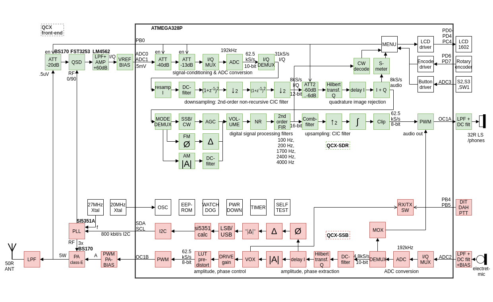

# uSDX Plus Orange: micro Software Defined Transceiver

**Firmware:** release de producción `v2.0.0`, modular (un único sketch en la raíz del proyecto) — paridad estricta con la referencia `usdx-legazy/` (ver `AGENTS.md`).

**uSDX Plus Orange** es una reconstrucción modular del firmware uSDX (original de PE1NNZ, linaje WhiteButtons de GW8RDI), mantenido por **EA7LJY**. Transceptor QRP SSB/CW/AM/FM sobre ATMEGA328P (2KB RAM, 32KB flash) con etapa TX clase-E EER (~5W PEP) y receptor SDR (detector Tayloe + transformada de Hilbert).

> **⚠️ Después de flashear:** Apaga la radio, vuelve a encender mientras mantienes pulsado el **botón del encoder (menú)** para resetear la EEPROM a valores de fábrica. Esto asegura que todos los ajustes se inicialicen correctamente.

## Estructura del firmware (la raíz es el sketch Arduino)

El nombre de la carpeta debe coincidir con el fichero principal (`usdx_plus_orange/` → `usdx_plus_orange.ino`).

| Fichero | Contenido |
|---------|-----------|
| `usdx_plus_orange.ino` | setup()/loop(), motor de menú, UI |
| `usdx_settings.h` | Solo configuración (modelo WHITE_BUTTONS + features) |
| `hw.h` | Pines, ADC, timers, ISRs, conmutación RX/TX |
| `rx.h` | Cadena DSP de RX (CIC, Hilbert, demod, AGC, NR, filtros) |
| `tx.h` | Modulador TX `ssb()`, CW, LUT, VOX |
| `cw.h` / `cat.h` / `vfo.h` / `menu.h` | Keyer + decodificador, CAT TS-480, VFO A/B + RIT/Split, menú declarativo |
| `display.h` / `i2c.h` / `si5351.h` / `lpf.h` / `perf.h` | LCD + encoder, I2C bit-bang, SI5351, placa LPF, medidor CPU |
| `usdx_filter.h` | Filtros IIR SSB/CW |
| `tests/` | Harnesses de paridad en host (sin hardware) |
| `tools/` | Seguimiento de flash/RAM por build |
| `usdx-legazy/` | Firmware de referencia de solo lectura (fuente de verdad de paridad, no se modifica) |
| `usdx-lab/` | Firmware de laboratorio: copia + instrumentación ADC/audio, sin CAT (ver `usdx-lab/README_LAB.md`) |

Docs: `AGENTS.md` (contrato de paridad, build, tests), `ROADMAP.md` (plan de mejoras), `HARDWARE_TEST_GUIDE.md` (flasheo + pruebas hardware).

### Compilación

```bash
arduino-cli compile --fqbn arduino:avr:uno .
# Sketch usa 30804 bytes (95%) de flash, 1189 bytes (58%) de RAM, 0 warnings
```

### Tests de paridad (host, sin hardware)

```bash
cd tests/parity_tx
python3 gen_parity_tx.py
gcc -O0 -o parity_tx main_test_tx.c tx_legacy.c tx_v2.c -lm && ./parity_tx
cd ../parity_rx
python3 gen_parity_rx.py
gcc -O0 -o parity_rx main_test_rx.c rx_legacy.c rx_v2.c -lm && ./parity_rx
cd ../ab_agc && ./run_ab_agc.sh
```

TX `ssb()` es bit-exacto respecto a legacy; core RX, filtros y AGC dan 0 mismatches (los niveles NR ≥2 difieren intencionadamente — mejora NR de 2 polos, ver `ROADMAP.md`).

---

## Ajustes recomendados

### TX (voz SSB)

| Menú | Valor | Beneficio |
|------|-------|-----------|
| 20 TX Drive | 4–6 | ~5W PEP; empezar bajo y subir viendo SWR |
| 28 Mic Atten | 0 | Atenuador 6 dB/paso; subir solo si el micro recorta |
| 30 TX Comp | ON | Compresor de voz 2:1, más potencia media |
| 31 TX LoCut | 2 (200 Hz) | Elimina retumbe sub-audio; ahorra potencia e IMD |
| 29 DIGI Mode | ON en digital | Path TX plano (USB + VOX + BW completo manual) |
| 23/24 PA Bias | Calibrar | Rango PWM donde arranca el PA / potencia máx |

### RX

| Menú | Valor | Beneficio |
|------|-------|-----------|
| 7 AGC | Fast (SSB) / Slow (CW) | Fast = respuesta legacy; Slow = nivel CW estable |
| 32 AGC Start | ON | Ganancia audible al instante (precarga x8) |
| 33 AGC Rec | 4 | Recuperación lenta: menos bombeo entre palabras |
| 8 NR | 1–2 (SSB) | Reducción de ruido 2 polos; más nivel en CW |
| 9/10 ATT/ATT2 | 0 al inicio | Subir si señales fuertes saturan el frontal |
| 11 S-meter | S o dBm | Indicador de señal |

---

## Menú (34 entradas)

| Id | Entrada | Rango |
|----|---------|-------|
| 0 | Volume | -1–16 (girar a la izquierda en 0 = apagado/encendido) |
| 1 | Mode | LSB, USB, CW, FM, AM |
| 2 | Filter BW | Full, 3000, 2400, 1800, 500, 200, 100, 50 Hz |
| 3 | Band | 160, 80, 60, 40, 30, 20, 17, 15, 12, 10, 6 m |
| 4 | Tune Rate | 10M, 1M, 0.5M, 100k, 10k, 1k, 0.5k, 100, 10, 1 |
| 5 | VFO Mode | A, B (+Split con pulsación larga) |
| 6 | RIT | ON, OFF |
| 7 | AGC | OFF, Fast, Slow |
| 8 | NR | 0–8 |
| 9 | ATT | 0, -13, -20, -33, -40, -53, -60, -73 dB |
| 10 | ATT2 | 0–16 (digital, 6 dB/paso) |
| 11 | S-meter | OFF, dBm, S, S-bar, wpm |
| 12 | CW Decoder | ON, OFF |
| 13 | Semi QSK | ON, OFF |
| 14 | Keyer Speed | 1–60 WPM |
| 15 | Keyer Mode | Iambic A, Iambic B, Straight |
| 16 | Keyer Swap | ON, OFF |
| 17 | Practice | ON, OFF (TX desactivado) |
| 18 | VOX | ON, OFF |
| 19 | Noise Gate | 0–255 |
| 20 | TX Drive | 0–8 (8 = envolvente constante) |
| 21 | CQ Interval | 0–60 s |
| 22 | CQ Message | Texto (48 caracteres) |
| 23 | PA Bias min | 0–254 |
| 24 | PA Bias max | 1–255 |
| 25 | Ref freq | 14–28 MHz (calibración del cristal) |
| 26 | IQ Phase | 0–180° |
| 27 | Backlight | ON, OFF |
| 28 | Mic Atten | 0–4 (6 dB/paso) |
| 29 | DIGI Mode | ON, OFF |
| 30 | TX Comp | ON, OFF |
| 31 | TX LoCut | OFF, 100, 200, 400 Hz |
| 32 | AGC Start | ON, OFF |
| 33 | AGC Rec | 1–8 (1 = legacy) |

Atajos (L=izquierdo, E=encoder, R=derecho): **E+giro** volumen · **R** modo · **R doble** filtro · **E doble** banda · **E / E largo** paso · **2x R largo** VFO · **R largo** RIT · **L** menú · **L+giro** menú rápido · **R** atrás · **E largo al encender** reset de fábrica.

Para voz SSB conecta un micro electret al jack de paddle (DOT = PTT, DASH = audio). Para modos digitales pon USB + VOX + ancho completo manualmente, audio por los jacks, y activa 29 DIGI Mode.

---

## Características de este firmware

- Paridad bit-exacta con la referencia legacy verificada (ver tests arriba)
- Mejoras conmutables por menú, todas con default legacy: S-meter en punto fijo, cálculo SI5351 rápido y exacto, I2C diferencial, cambio de banda direccional, atenuador de micro, path DIGI plano, ALC en TX, compresor de voz 2:1, low-cut TX, NR de 2 polos, AGC arranque rápido / recovery anti-bombeo / modo Slow (M0PUB)
- Subconjunto CAT TS-480 completo, VFO A/B + RIT/Split, keyer Iambic-A/B/Straight + decodificador CW + mensajes CQ, menú procedimental con persistencia EEPROM

Detalle y medidas: `ROADMAP.md`. Validación hardware: `HARDWARE_TEST_GUIDE.md` + `usdx-lab/GUIA_TEST_HW.md`.

---

## Historial de revisiones

| Rev. | Fecha | Características |
|------|-------|-----------------|
| v2.0.0 | 2026-09-15 | Release modular de producción en la raíz (paridad verificada); copia instrumentada `usdx-lab/` para pruebas hardware. |

Linaje: uSDX original de PE1NNZ → WhiteButtons de GW8RDI → reconstrucción modular con paridad (este firmware).

---

## Esquema / Hardware




Variantes hardware uSDX (Sandwich de DL2MAN, transceptor WB2CBA y otras) en el [uSDX Forum]. Subida del firmware: compilar en Arduino IDE (placa `Arduino Uno`) o grabar por ISP; la radio corre la MCU a 20 MHz externo — ver `HARDWARE_TEST_GUIDE.md` para fuses y flasheo. **Pruebas de TX siempre contra carga ficticia de 50 Ω.**

## Créditos

Concepto, circuito y código originales del uSDX por _Guido (PE1NNZ)_; PCB sándwich y LPF clase-E por _Manuel (DL2MAN)_. Este firmware modular mantenido por **EA7LJY**.

[uSDX Forum]: https://groups.io/g/ucx
